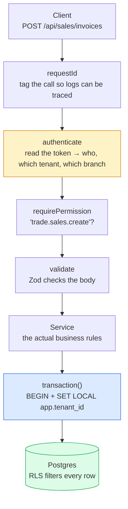
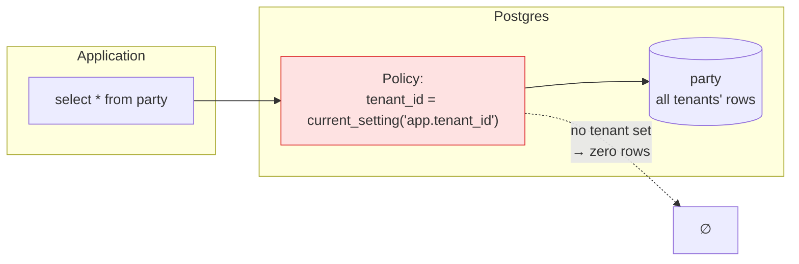
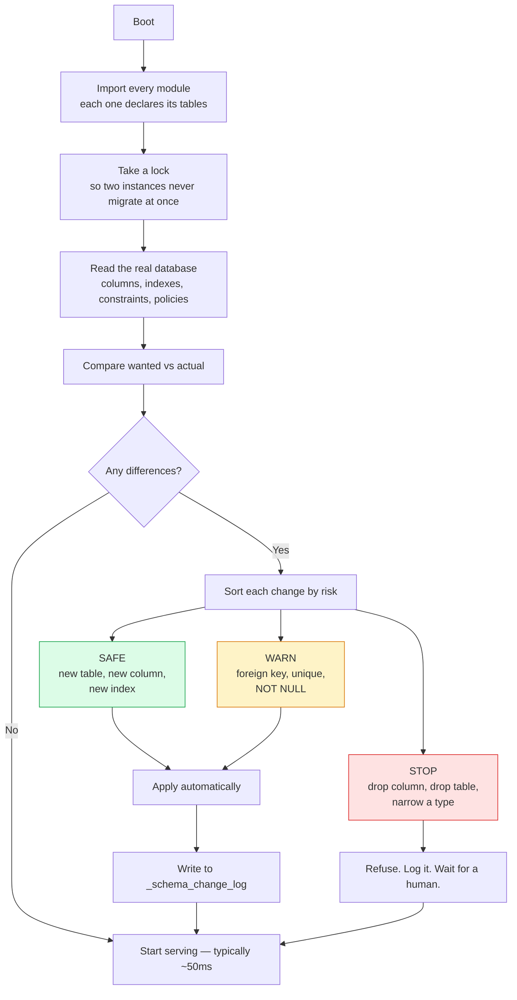
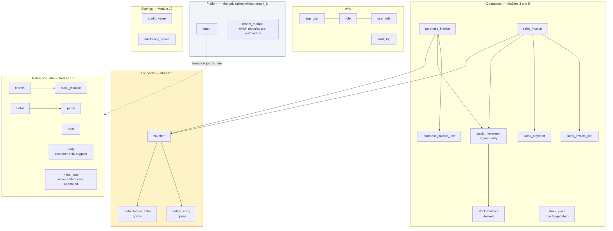
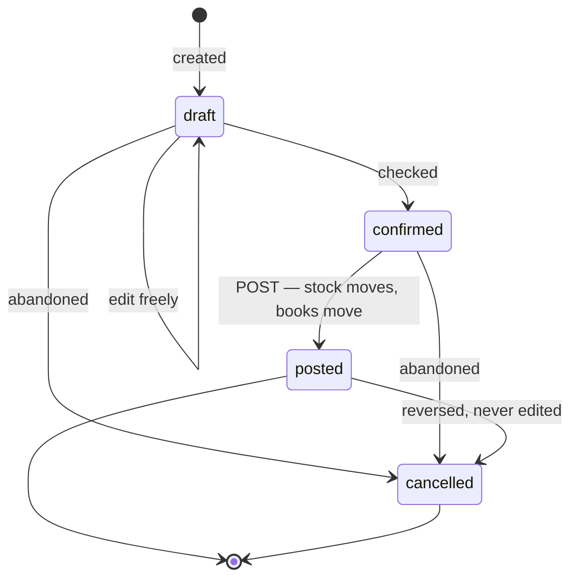
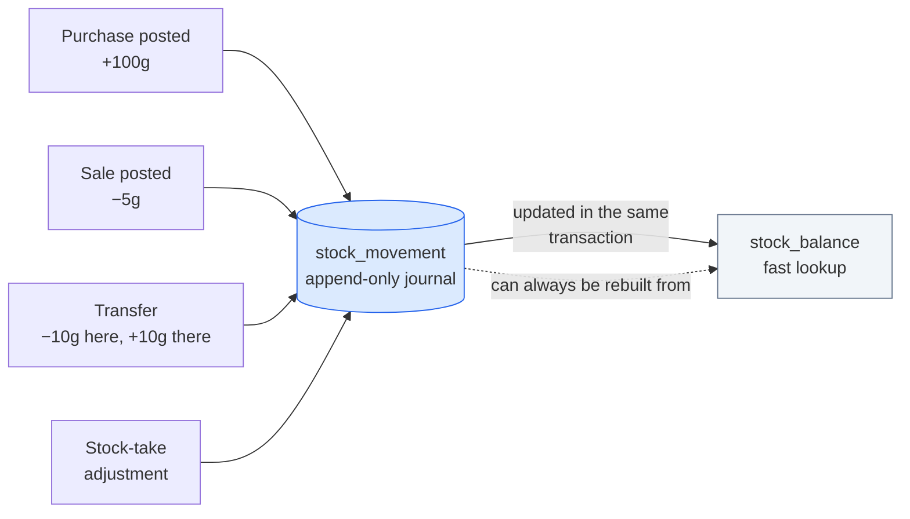
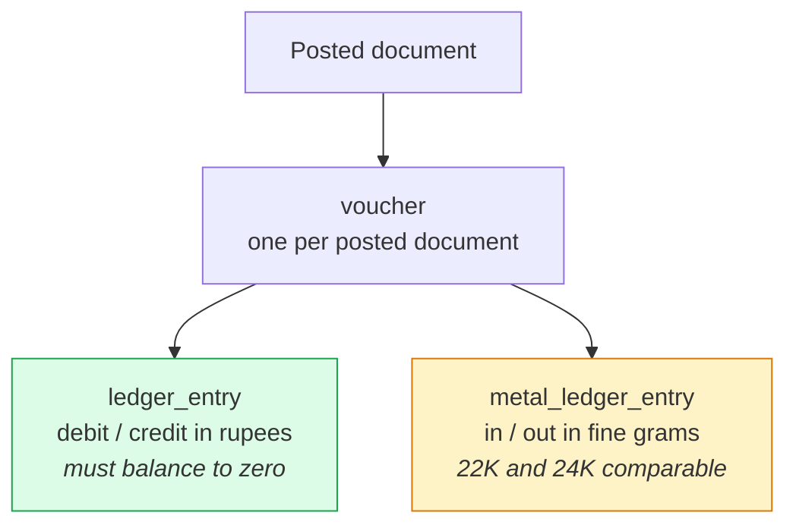
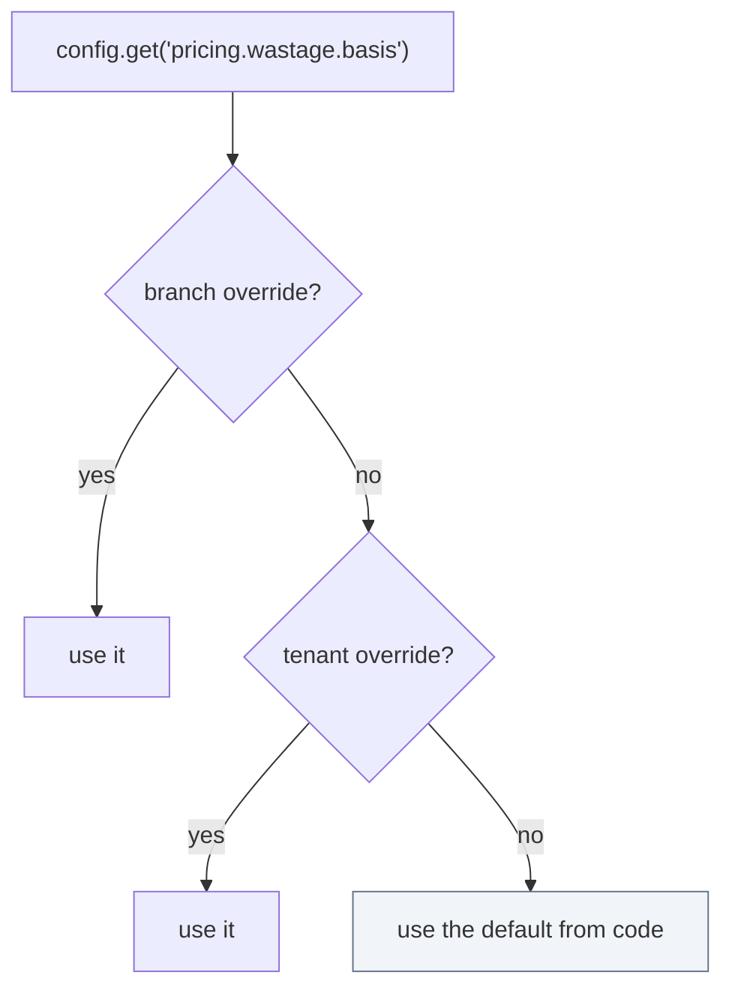
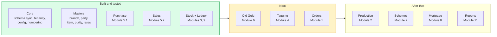

# KaratSetu Backend — How It Is Built

Plain-language guide to the database and backend design.

---

## 1. The four decisions everything else follows from

| # | Decision | Why |
|---|---|---|
| 1 | **One database, `tenant_id` on every row, enforced by Postgres itself** | One place to back up, one place to upgrade. The database refuses cross-tenant reads even if the code has a bug. |
| 2 | **The code describes the tables; the app fixes the database on boot** | You never hand-write a migration. You edit a TypeScript file and restart. |
| 3 | **Nothing stores a balance — it stores what happened** | "Why is 4 grams missing?" is answerable, because every movement is still there. |
| 4 | **Two ledgers: rupees and grams** | A jewellery business owes money *and* metal. One number cannot express both. |

---

## 2. How a request travels



The important step is **G**. Every query runs inside a transaction that has already
been told which tenant it belongs to. Because `SET LOCAL` is undone when the
transaction ends, a connection can never go back to the pool still carrying the
last request's tenant.

---

## 3. Multi-tenancy — why `tenant_id` is not enough on its own

You said tenant id, not tenant tables. Agreed. But a column alone only works
while every single query remembers to filter on it. One forgotten `WHERE` and a
customer sees another jeweller's books.

So the column is backed by **Row Level Security** — a rule inside Postgres:



Three things make this real rather than decorative:

1. **`FORCE ROW LEVEL SECURITY`** — without it the table's owner (your app,
   because it creates the tables) quietly bypasses every policy.
2. **The app connects as a non-superuser.** Superusers ignore RLS entirely.
3. **No tenant set means no rows**, not all rows. Deny by default.

**Proven on the running system:**

```
no tenant set        → 0 parties visible
tenant = demo        → 2 parties, 2 sales invoices
tenant = rival       → 0 parties, 0 sales invoices
demo writes a row tagged 'rival'
                     → ERROR: new row violates row-level security policy
```

> **One setup step this requires:** the app must not connect as a superuser.
> Create a dedicated role (`karatsetu_app`) that owns the schema. The local dev
> database is already set up this way.

---

## 4. The self-updating schema

This is the piece you asked for specifically: *the app checks the database at
startup and fixes it if it does not match.*

### The loop



### The rule that makes it safe to run on every boot

> **Adding is automatic. Removing and rewriting is not.**

Nothing that can destroy data ever runs by itself. If you delete a column from
the code, the app tells you the database still has it — and leaves it alone.

### Declaring a table

```ts
export const salesInvoiceTable = defineTable({
  name: 'sales_invoice',
  module: 'sales',
  columns: {
    ...documentHeaderColumns({ partyLabel: 'customer' }),
    channel: col.enum(['counter', 'wholesale', 'export', 'online'], { notNull: true, default: "'counter'" }),
    paid_amount: col.money({ notNull: true, default: '0' }),
  },
  uniques: [{ columns: ['doc_number'] }],
  indexes: [{ columns: ['customer_id', 'doc_date'] }],
});
```

You did not write `id`, `tenant_id`, `created_at`, `updated_at`, `created_by`,
`updated_by`, the tenant index, or the RLS policies. Those are added for you,
the same way on every table, so they cannot be forgotten on the one table where
it matters.

`uniques` is worth noticing: on a tenant-scoped table `['doc_number']` silently
becomes `['tenant_id', 'doc_number']`. Otherwise the first tenant to use
`INV/2026-27/00001` would lock every other tenant out of that number forever.

### The four modes

| `SCHEMA_SYNC_MODE` | Behaviour | Use it |
|---|---|---|
| `off` | Do nothing | Never, really |
| `verify` | Report differences, refuse to boot | **Production** |
| `safe` | Apply additive changes, block destructive ones | **Development** (default) |
| `force` | Apply everything, including drops | A throwaway database only |

`npm run db:plan` shows what *would* change without touching anything. Run it
before every deploy.

### Actual output from this repository

```
Model declares 38 tables.
339 change(s) pending:
  SAFE  create table sales_invoice (40 columns)
  WARN  link sales_invoice.customer_id -> party
  WARN  make tenant_id + doc_number unique on sales_invoice
  SAFE  index sales_invoice (customer_id, doc_date)
  SAFE  turn on tenant isolation for sales_invoice
  ...
  168 safe · 171 needs care · 0 blocked

→ applied: 339, blocked: 0, failed: 0
→ second run: "Database matches the application model." (49ms)
```

---

## 5. The shape of the database

38 tables today, in six families:



### Three modelling choices worth explaining

**`party` is one table, not `customer` + `supplier`.**
In this trade the same firm is routinely both — you buy findings from a jeweller
on Monday and sell them a bangle on Friday. One row means one balance, instead
of two that someone has to reconcile by hand.

**`item.tracking` is either `lot` or `piece`.**
Raw metal is a pool measured in grams. A tagged finished piece is one unique
object. Almost every difference between raw-material stock and showroom stock
falls out of this single field — including, as we found while testing, that a
*piece count* is meaningless for bulk gold: you buy 100g once and sell it across
thirty bills.

**Money is `numeric(20,4)`, weight is `numeric(16,6)`. Never floats.**
`0.1 + 0.2` is `0.30000000000000004` in JavaScript. In a jewellery shop that is
a real rupee somebody has to explain. Numbers travel as strings end to end and
are added with integer maths.

---

## 6. Every document has the same life



**A draft is scratch paper. Posting is the moment everything happens at once.**

Posting a sales invoice, in one transaction:

```
    stock out (at cost)  ·  revenue recognised  ·  GST payable
    customer debited     ·  metal ledger out    ·  piece marked sold
```

All of it, or none of it.

After posting, the document is **read-only**. A mistake is fixed with a
reversing document, never by editing history. That one rule is what lets an
auditor trust the numbers a year later — and it is why `stock_movement` rows are
never updated or deleted, only mirrored:

```
  direction | reason | net_weight |   kind
  ----------+--------+------------+----------
  out       | sale   |  12.500000 | original
  in        | sale   |  12.500000 | reversal     ← the correction, not an erasure
```

---

## 7. Stock: a journal, not a counter



Nothing ever writes "the balance is now X". Every change appends a row saying
what moved and why, and the balance follows. `stock_balance` is only a cache —
`POST /api/inventory/balances/rebuild` recomputes every figure from the journal.
Nothing should ever need it, which is exactly why it exists.

---

## 8. The dual ledger

A customer who leaves 10g of old gold against a future purchase is owed **metal**,
not money. If the rate moves overnight, the rupee value of that debt moves and
the gram figure does not. So two journals hang off one voucher:



Weights are stored as **fine weight** — pure metal content — so 10g of 22K
(9.16g fine) and 10g of 18K (7.5g fine) can be added together meaningfully.

`postVoucher` refuses to write anything if the rupee side does not balance.
There is no API for a half-entry.

**From the running system after one purchase and one sale:**

```
 code | name               |   debit    |   credit
------+--------------------+------------+------------
 1000 | Cash in Hand       |  50,000.00 |
 1010 | Bank Accounts      |  26,941.00 |
 1200 | Stock in Hand      | 620,000.00 |  62,000.00
 1300 | GST Input Credit   |  18,600.00 |
 2000 | Sundry Creditors   |            | 638,600.00
 2200 | GST Output Payable |            |   2,241.00
 4000 | Sales              |            |  74,700.00
 5100 | Cost of Goods Sold |  62,000.00 |
                             ──────────   ──────────
                             777,541.00   777,541.00   BALANCED

 Metal Stock: 91.600g in − 9.160g out = 82.440g
```

That 82.440g comes from the metal ledger. The stock journal independently says
82.440g fine. Two separate systems agreeing is the cross-check that catches
mistakes.

---

## 9. Config-driven, and what that actually means

Settings are **declared in code** with a type, a default and a description, then
**overridden per tenant or per branch** in the database.



Because the setting is declared once, the settings screen builds itself, and a
value that no longer validates falls back to the default with a warning instead
of taking a request down.

The pricing engine reads these keys, so when a tenant flips
*"charge making on gross weight"* to off, **every screen in the product changes
together** — because there is only one place that prices a line.

```
  net weight   = gross 10.000 − stones 1.000            =  9.000 g
  fine weight  = net 9.000 × 91.6%                      =  8.244 g
  metal        = net 9.000 × ₹6,500                     = 58,500.00
  wastage 8%   = 0.720 g × ₹6,500                       =  4,680.00
  making       = 10.000 g × ₹450   ← gross, per config  =  4,500.00
  stones                                                 =  8,000.00
                                                          ──────────
  taxable                                                = 75,680.00
  GST 3%, same state → CGST 1,135.20 + SGST 1,135.20     =  2,270.40
                                                          ──────────
  line total                                             = 77,950.40
```

Module visibility works the same way. `GET /api/tenancy/modules` returns what
this tenant should see, so a retailer simply never receives the production
module:

```
Demo Jewellers (retailer) → orders, stock, tagging, trade, old_gold,
                            scheme, mortgage, accounts, masters, reports, settings
                            ↑ no "production" — that is manufacturer-only
```

---

## 10. Build order

You said you want to go step by step, starting with the base processes. That is
the right instinct — purchase and sales exercise every piece of shared
machinery, so everything after them is mostly filling in shapes.



**Why this order.** Old Gold is next because it is the most common thing a
jewellery POS does that a generic ERP cannot, and it reuses the sales invoice
you already have (it becomes a payment tender). Tagging follows because
piece-tracked stock needs tags before showroom inventory is usable. Orders after
that, because an order is a sales invoice that has not happened yet. Production
is the biggest single module and only matters to manufacturer tenants, so it
waits until the retail side is solid.

### Adding a module — the whole checklist

1. `src/modules/<name>/<name>.schema.ts` — declare the tables
2. Add one import line to `src/bootstrap.ts`
3. `<name>.service.ts` — the business rules
4. `<name>.routes.ts` — the HTTP endpoints, wired up in `app.ts`
5. Restart. The tables appear.

---

## 11. Things to decide as you go

Flagging these now because they are cheap to change today and expensive later.

| Question | Current behaviour | Worth revisiting when |
|---|---|---|
| **Does wastage remove metal from stock?** | No — wastage is charged to the customer but the weight issued is the actual weight. The difference is margin. | You reconcile physical stock and find the gap. Some shops treat wastage as real metal consumed. |
| **Valuation method** | Weighted average per item + purity + location | You need FIFO for tagged pieces. The config key already exists; the FIFO path is not written. |
| **Dates and time zones** | `date` columns are kept as plain `YYYY-MM-DD` strings | Never, hopefully — but this is why. A JS `Date` serialised an invoice dated 14 Sep as `2026-09-13T18:30:00Z` in IST. Fixed by not parsing dates at all. |
| **GST on making charges** | One composite 3% rate | Your accountant asks for the separate 3% + 5% treatment. The config key exists; the calculation branch is not written. |
| **e-Invoice / IRN** | Columns exist, no portal integration | You cross the turnover threshold. |
| **Audit log** | Table exists, nothing writes to it yet | Before go-live. Posting and cancelling should both write a row. |

---

## 12. Running it

```bash
npm install
cp .env.example .env        # paste your connection string
npm run db:plan             # what would change?
npm run db:sync             # apply it
npm run db:seed             # a demo tenant to log into
npm run dev
```

| Command | What it does |
|---|---|
| `npm run db:plan` | Shows pending changes. Touches nothing. `SHOW_SQL=true` prints the SQL. |
| `npm run db:sync` | Applies them without starting the server. |
| `npm run db:seed` | Creates a tenant with accounts, purities, branch, locations, roles and an owner login. |
| `npm run dev` | Syncs the schema, then serves on :4000. |
| `npm test` | 30 tests — decimal maths, pricing, financial year, permissions, schema diff safety. |
